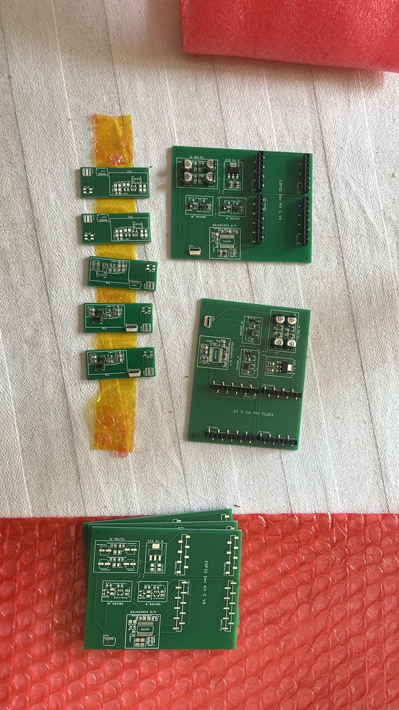
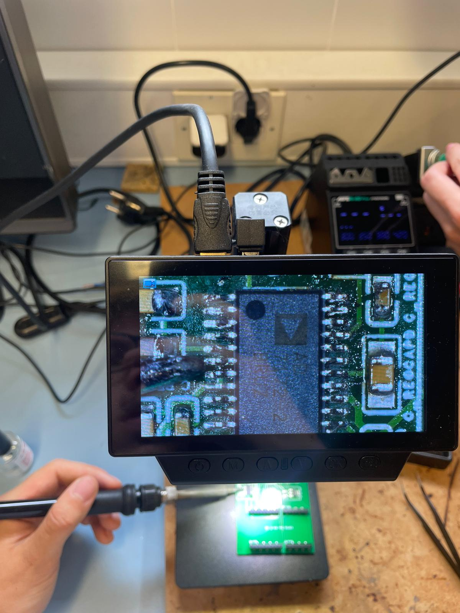
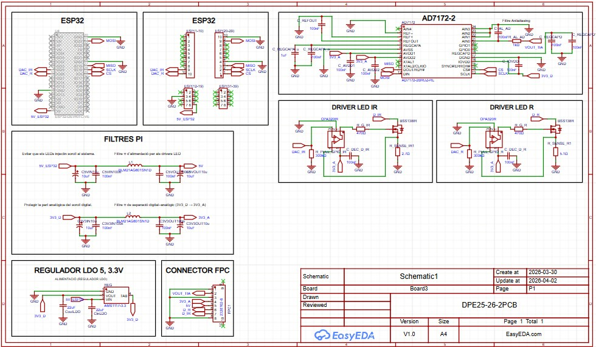
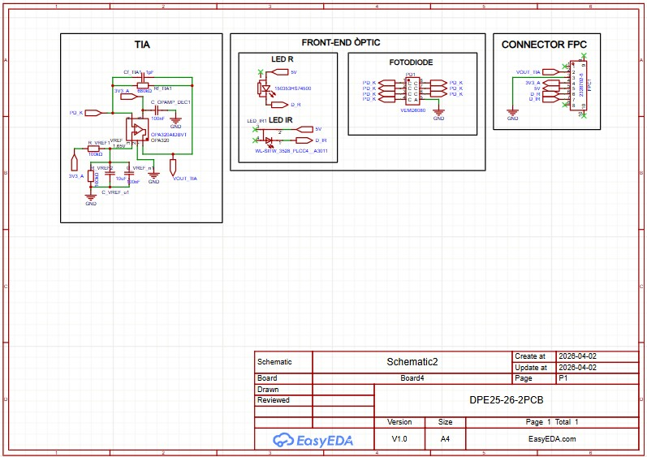
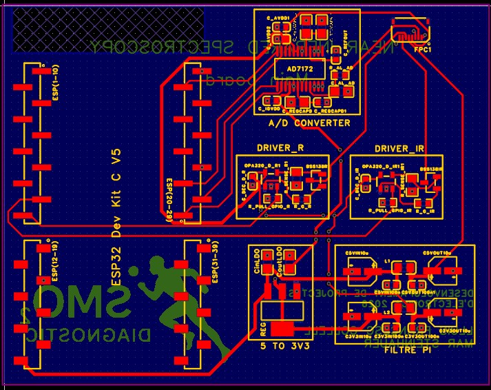
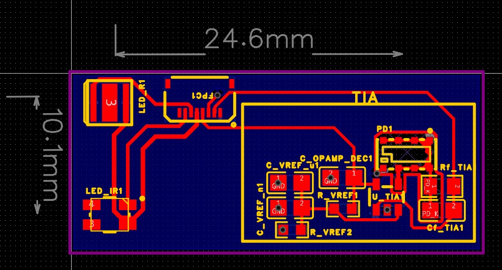

## Muscle Fatigue Sensor (NIRS)

Development of a wearable muscle fatigue sensor based on the Near-Infrared Spectroscopy (NIRS) technique for monitoring muscle oxygenation (SmO₂). The project combines custom hardware and embedded software around an ESP32 microcontroller, with the objective of creating an accessible and reproducible wearable system.

The hardware side includes custom PCB design in EasyEDA, integration of optical sensing electronics, and practical work with SMD components and microscope soldering. The embedded software development includes firmware architecture, task processing, SmO₂ calculation algorithms, BLE communication, and a Python interface for data acquisition and visualization.

  

A future goal of the project is the integration of a 3D-printed enclosure and wearable band to transform the prototype into a complete open-source wearable device. The project was mainly developed as a hands-on introduction to real-world electronics engineering, embedded systems, PCB design, firmware development, and hardware/software integration.

  

---

### Hardware
Hardware development and PCB design were created in EasyEDA, including the `.epro` project design files for the custom boards and electronic schematics.

The hardware design is divided into two different PCBs. The first board contains the optical sensing stage, including the LEDs, photodiode, and transimpedance amplifier (TIA) required for signal acquisition. The second board contains the digital and processing stage, integrating the ESP32 microcontroller, the AD7172 24-bit ADC, signal conditioning filters, drivers, and supporting circuitry for data acquisition and communication.

<table>
  <tr>
    <td align="center">
      
       
      Main Schematic
    </td>
    <td align="center">
      
       
      Optic Schematic
    </td>
  </tr>
</table>

<table>
  <tr>
    <td align="center">
      
       
      Main PCB
    </td>
    <td align="center">
      
       
      Optic PCB
    </td>
  </tr>
</table>

### Software
Embedded software and firmware development were implemented using PlatformIO for the ESP32 environment. BLE communication was mainly developed using the NimBLE library.

The software architecture includes both a simulation mode and a real hardware implementation mode, selectable through a boolean configuration variable. Different modules were developed to separate responsibilities, including `adc_hw` for real ADC acquisition, `adc_sim` for simulated data generation, `main` for task management and application flow using FreeRTOS, `ble_service` for BLE communication, `nirs_logic` for SmO₂ calculations, and `config` for general configuration management.

Data visualization, graphical representation, and CSV handling were implemented in Python using `matplotlib` and `asyncio` for asynchronous communication and processing. The repository also includes a `tests` folder containing previous experiments, prototypes, and development tryouts created during the early stages of the project.

  

